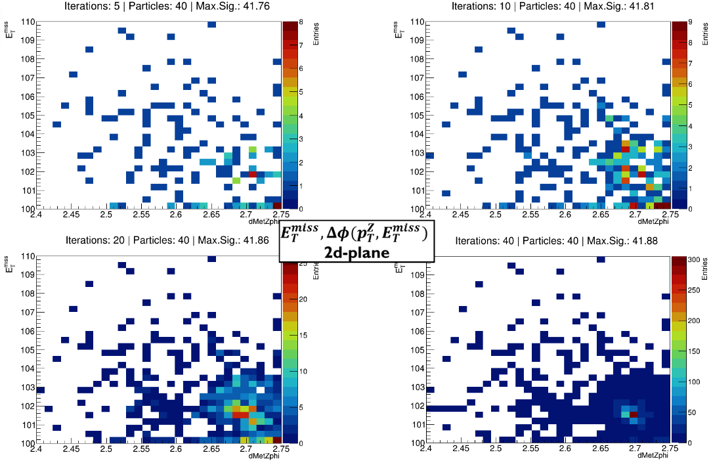

# Particle Swarm Optimization Algortihm (PSO)

This is a custom algorithm based on the concepts of the basic particle optimization 
algorithm. The aim of this script is to construct a PSO algortihm utilizing Monte Carlo samples in order to find the 
optimal set of phase space kinematic variables for which the signal significance is 
maximized. The kinematic variables used are the following: $Δ \phi (p^{Z}_{T}, E^{miss}_{T})$, $E^{T}_{miss}$, $E^{miss}_{T}/H_{T}$.

The optimal set is to be used by the CRO algorithms in order to find the signal leading to the maximum possible significance given by $ Z = \sqrt{2(s+b) \cdot ln\left( 1 + \frac{s}{b} \right) - s}, \ $ [[G.Cowan et al.]](https://arxiv.org/abs/1007.1727)
. The algorithm results are not reporducible. The algorithm usually gets stuck on local minima. Consequently, consecutive scans have been realised on more restricted spaces that generally generate higher signal significance values. The optimal set of variables found is the following $(Δ \phi (p^{Z}_{T}, E^{miss}_{T}), E^{T}_{miss}, E^{miss}_{T}/H_{T} ) \rightarrow (2.69, 101.5, 0.737) $. 
 
An example of the PSO algorithm progress on the $(E^{T}_{miss},Δ \phi(p^{Z}_{T}, E^{miss}_{T}))$ 2d plane leading to a significance value of 41.88 is given in the following figure:

