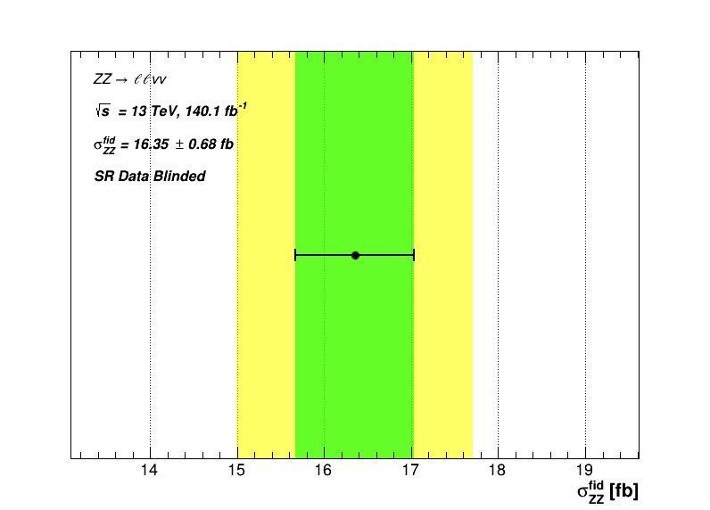

# ZZ Production Analysis at 13 TeV

This repo refers to the thesis submitted in partial fullfillment of my Master degree in Subatomic Physics and technological applications. The title of the thesis is the following: 

*Study of signal to background discrimination and determination of the ”signal strength” for the ZZ boson production in proton-proton collisions at 13 TeV with the ATLAS detector.*

## Abstract

The purpose of this thesis was to study methods for the analysis of experimental data in order to discriminate signal from background events related to the production of two Z bosons. The study was conducted through the identification of the channel $\mathbf{ZZ \rightarrow \ell \ell \nu \nu}$ where the two Z bosons decay into 2 leptons and 2 neutrinos. The thesis begins with the study and optimization of a suitable region in the phase space in order to maximally discriminate the signal events from all others that constitute the background. Various computational methods were used utilizing simulation samples and the results were cross-validated. Subsequently, the various sources of background were studied by defining appropriate regions in the phase space, one for each type of background, and utilizing the experimental data. The aim of the background study was to provide a more accurate estimation of the signal which is directly related to the background. The signal and background study resulted in the “signal strength” estimation which constitutes an expression of the event yield that has been estimated for the desired signal process. Utilizing the signal strength factor, a cross section measurement has been conducted for the signal channel under study. Both MC and real data samples have been utilized, collected by the **ATLAS** experiment during the full **LHC Run II** period and corresponding to 140.1 $fb^{-1}$ integrated luminosity.

## Brief Presentation

The $pp \rightarrow ZZ$ production has been studied through the $ZZ \rightarrow \ell \ell \nu \nu $ channel:

The study of the $ZZ \rightarrow \ell \ell \nu \nu $ signal channel requries an extensive study of the signal as well as the various background processes. The study is performed in terms of various kinematic variables like the missing transverse energy $E^{miss}_T$ due to the neutrino pair passing through the detector without getting identified.

Various sources of background are present due to the large $E^{miss}_T$ signal signature. **Monte Carlo** simulation samples are utilized. A preliminary phase space attributes the following abundance in signal and the various backgrounds:

A cut based analysis is performed: Certain kinematic variables are selected according to their signal-to-background discriminating power in order to define a phase space maximally enriched in signal. This phase space is called **Signal Region (SR)**. The criterion used is the **Signal Significance**:

$$ Z = \sqrt{2(s+b) \cdot ln\left( 1 + \frac{s}{b} \right) - s} $$

where s and b are the total signal and background processes in the selected phase space respectively. An example of a study on the kinematic variable $E^{miss} / H_T $ is given below:

The signal significance plot indicates that a around the value 0.8 should give better signal-to-background discrimination. A more thorough brute force scan of the area around the value 0.8 is performed. A type of heuristic custom algorithm based on the **Particle Swarm Optimization (PSO)** heuristic algorithm has been created for cross-validation. 

Following this methodology for several variables, a more "clean" signal region is obtained:

An accurate estimation of the desired signal process $ZZ \rightarrow \ell \ell \nu \nu$ in the SR, requries an accurate estimation of the various backgrounds as well.

 To study the background both Monte Carlo and real data samples are utilized. Various phase spaces are defined enriched in each particular background to better study it called **Control Regions (CR)**.

In each CR, a data-driven analysis is performed to calculate a scaling factor $\mu$, accounting for the discrepancy between the data and the corresponding MC prediction. An example is shown for the $3 \ell$ CR used for the study of the WZ background:

A scaling factor is calculated for the each type of background. Every scaling factor is utilized to correct (scale) the various backgrounds leading to a scaling facor for signal called **Signal Strength**. The signal strength is of great importance since it can be utilized to measure the cross section of the signal process $ZZ \rightarrow \ell \ell \nu \nu$. 

A more sophisticated approach involing a **maximum likelihood** function is followed to calculate and corss-validate the scaling factor values as well. The values obtained using the maximum likelihood method are the following:

The data sample in the SR has been kept **blinded** during the entire analysis. The corresponding MC prediction in the SR has been used as **pseudo-data** instead leading to signal strength $\mu_S$ value compatible with 1.

<!-- A Validation Region, SR-like and independent from all the other regions, has been created to test the performance of the scaling factors versus various kinematic variables.
 -->

Various sources of uncertainties have been studied followed by a measurement of the $ZZ \rightarrow \ell \ell \nu \nu$ process. The cross section has been obtained by the MC theoretical prediction $\sigma^{fid}_{ZZ, \ MC}$ corrected by the signal strength $\mu_S$ obtained by the analysis performed in the present work:

$$ \sigma^{fid}_{ZZ, \ meas} = \mu_S \cdot  \sigma^{fid}_{ZZ, \ MC} $$

**Note:** The SR data sample has been kept blinded leading to a value $\mu_S = 1.006 \pm 0.032$ as expected since the corresponding MC prediction has been used as pseudo-data instead. As a result, the cross section measurement corresponds to the theoretically predicted value $\sigma^{fid}_{ZZ, \ MC}$ as expected. However, following the analysis procedure presented, a measurement of the cross section by utilizing the new information provided by the SR data sample, can be performed.