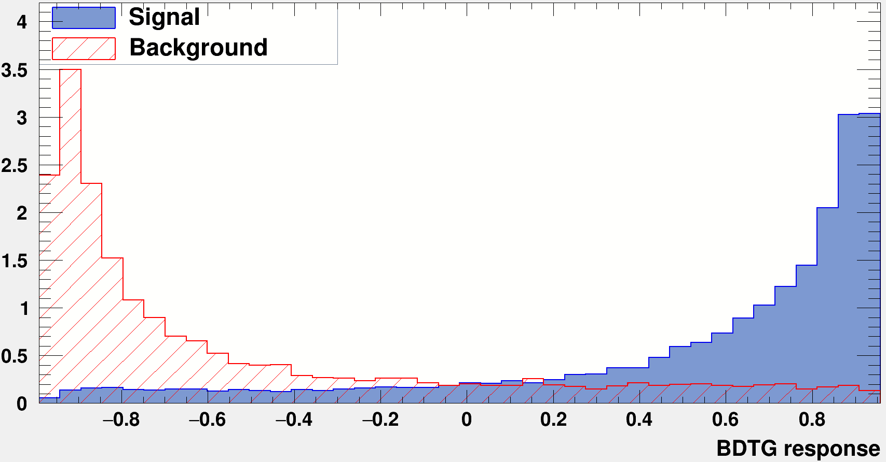
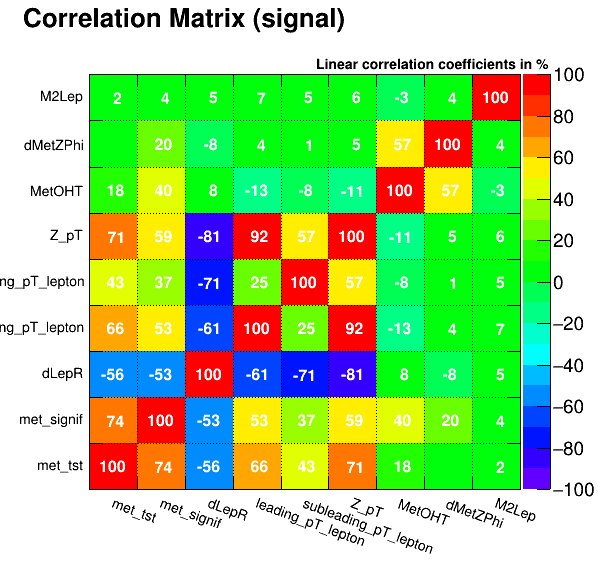
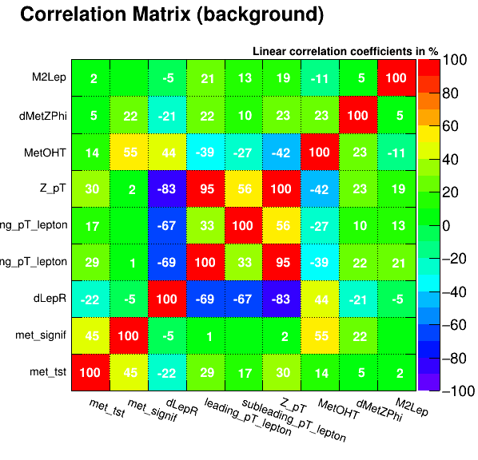

# Boosted Decision Trees Training Script

This script utilized the ROOT TMVA library for multivariate analysis. This is a more sophisticated approach compared to simple brute force algorithms or the heuristic PSO algorithms where simple rectangular cuts are realised and correlations between variables are not taken under consideration. The variables taken under consideration in the current script are shown in the following table:

   loader.AddVariable("met_tst", 'F');
   loader.AddVariable("met_signif", 'F');
   // loader.AddVariable("mT_ZZ", 'F');
   loader.AddVariable("dLepR", 'F');
   loader.AddVariable("leading_pT_lepton", 'F');
   loader.AddVariable("subleading_pT_lepton", 'F');
   loader.AddVariable("Z_pT", 'F');
   // loader.AddVariable("frac_pT", 'F');
   // loader.AddVariable("sumpT_scalar", 'F');
   loader.AddVariable("MetOHT", 'F');
   // loader.AddVariable( "RhoZ := Z_pT/(leading_pT_lepton+subleading_pT_lepton)", 'F' );
   // loader.AddVariable("dLepPhi:=fabs(lepplus_phi-lepminus_phi)", 'F');
   loader.AddVariable("dMetZPhi", 'F');
   // loader.AddVariable("LepRatio := subleading_pT_lepton/leading_pT_lepton", 'F');
   // loader.AddVariable("dLepEta:=fabs(lepplus_eta-lepminus_eta)", 'F');
   loader.AddVariable("M2Lep", 'F');

| Variables | 
|----------|
| $E^{miss}_{T}$ | 
| $\sigma(E^{miss}_{T})$ | 
| dLepR | 
| $p_{T}^{\ell1}$ | 
| $p_{T}^{\ell2}$ | 
| $p_{T}^{Z}$ | 
| $E^{miss}_{T} / H_{T}$ | 
| $\Delta \phi (p^{Z}_{T}, E^{miss}_{T})$ | 
| M2Lep| 

The input variables have been ranked in terms of their respective signal-to-background discriminating power:

| Rank | Variable              | Separation   |
|------|-----------------------|--------------|
|   1  | $\sigma(E^{miss}_{T})$            | 4.594e-01    |
|   2  | $E^{miss}_{T} / H_{T}$                | 3.372e-01    |
|   3  | $E^{miss}_{T}$               | 1.808e-01    |
|   4  | $\Delta \phi (p^{Z}_{T}, E^{miss}_{T})$              | 1.751e-01    |
|   5  | $p_{T}^{Z}$                  | 9.441e-02    |
|   6  | dLepR                 | 6.721e-02    |
|   7  | $p_{T}^{\ell1}$      | 6.264e-02    |
|   8  | M2Lep                 | 2.064e-02    |
|   9  | $p_{T}^{\ell2}$   | 1.530e-02    |

The algorithm performance has been explored for different hyperparameter values. The hyperparameter values used that attributed the best performance are the following:

| Hyperparameters | | 
|----------|----------|
| Parameter | Value |
| NTrees | 400 |
| MinNodeSize | 10% |
| BoostType | Grad |
| Shrinkage | 0.2 |

Monte Carlo samples have been given to the model for signal and background respectively in the Signal Region. The samples have been splitted in training and test samples and their performance has been checked for consistency. 

The rsponse of the BDTG model is shown is shown on the following figure. The signal and background events are clearly distributed around 1 and -1. respectivley.

The training script offers valuable information for the input variable correlations as well. In the following figures, the correlation coefficients are given for the signal and background respectively:

